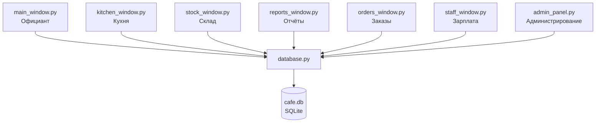
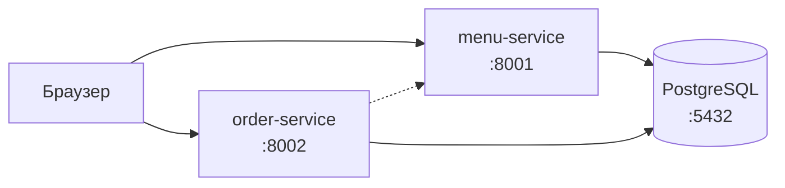
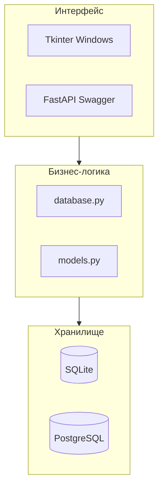

# Архитектура системы

## Десктоп-приложение

## Микросервисы (Docker)

| Сервис | Порт | Назначение |
| :--- | :---: | :--- |
| menu-service | 8001 | Меню, склад |
| order-service | 8002 | Заказы, кухня |
| db | 5432 | PostgreSQL |