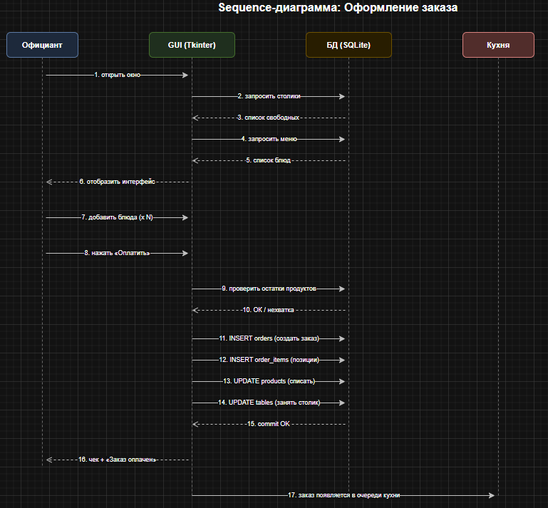
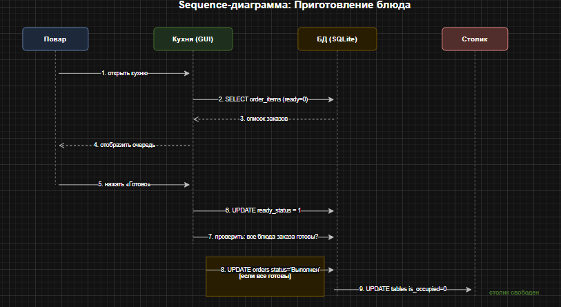

# Use-cases и Sequence-диаграммы системы «Кафе»

## UC-1: Оформление заказа

**Актёр:** Официант

**Предусловие:** В зале есть свободные столики, склад содержит продукты.

**Основной сценарий:**
1. Официант открывает главное окно системы
2. Система отображает список свободных столиков
3. Официант выбирает столик из выпадающего списка
4. Система отображает актуальное меню (только доступные блюда)
5. Официант добавляет блюда в корзину, указывая количество
6. Система отображает текущий состав заказа и итоговую сумму
7. Официант нажимает «Оплатить»
8. Система проверяет наличие продуктов на складе по техкартам
9. При нехватке — предлагает автоматически пополнить склад
10. Система списывает продукты, создаёт заказ в БД со статусом «Готовится»
11. Система помечает столик занятым

**Постусловие:** Заказ создан, столик занят, продукты списаны, блюда в очереди кухни.

---

## UC-2: Приготовление блюда

**Актёр:** Повар

**Предусловие:** На кухне есть заказы со статусом «Готовится» или «Оплачен».

**Основной сценарий:**
1. Повар открывает окно «Экран кухни»
2. Система отображает очередь блюд с сортировкой по времени создания
3. Для каждого блюда показано: номер заказа, столик, название, количество, время приготовления
4. Повар готовит блюдо
5. Повар выбирает блюдо в таблице и нажимает «Отметить готовым»
6. Система меняет статус блюда на «готово» (ready_status = 1)
7. Если все блюда заказа готовы — система меняет статус заказа на «Выполнен»
8. Система автоматически освобождает столик

**Постусловие:** Блюдо отмечено готовым, столик освобождён (если заказ полностью готов).

---

## UC-3: Управление складом

**Актёр:** Администратор / Шеф-повар

**Предусловие:** На складе есть продукты.

**Основной сценарий:**
1. Пользователь открывает окно «Склад продуктов»
2. Система отображает все продукты с цветовой индикацией:
   - Красный — нет в наличии (0 ед.)
   - Жёлтый — заканчивается (< 1 ед.)
   - Зелёный — в норме
3. Доступен поиск продуктов по названию
4. Для пополнения: выбрать продукт, нажать «Пополнить», ввести количество
5. Система обновляет остаток и пересчитывает статистику (общая себестоимость)

**Постусловие:** Остатки обновлены, статистика пересчитана.

---

## UC-4: Расчёт зарплаты персонала

**Актёр:** Бухгалтер / Управляющий

**Предусловие:** Есть закрытые заказы за выбранный месяц.

**Основной сценарий:**
1. Пользователь открывает окно «Персонал и ЗП»
2. Вводит месяц в формате ГГГГ-ММ и нажимает «Рассчитать»
3. Система вычисляет для каждого сотрудника:
   - Оклад из таблицы должностей
   - Базу для премии:
     - Официант — личная выручка за месяц
     - Бариста — выручка бара, делённая на количество бариста
     - Повар — выручка кухни, делённая на количество поваров
     - Администратор — общая выручка, делённая на количество админов
   - Премию = база * процент_премии / 100
   - Итого = оклад + премия
4. Система отображает общий фонд оплаты труда и выручку кафе за месяц

**Постусловие:** Таблица с расчётами отображена.

---

## UC-5: Просмотр отчётов

**Актёр:** Управляющий

**Основной сценарий:**
1. Пользователь открывает окно «Отчёты»
2. Вкладка «Выручка»:
   - Вводит дату, нажимает «Показать»
   - Система отображает: общую выручку, количество чеков, выручку по официантам, проданные блюда
3. Вкладка «ТОП-5»:
   - Система показывает 5 самых популярных блюд за всё время

**Постусловие:** Отчёты отображены.

---

## Sequence-диаграмма: Оформление заказа

## Sequence-диаграмма: Приготовление блюда

